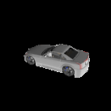
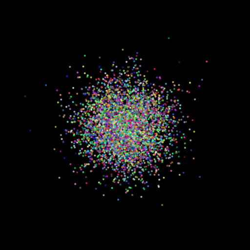
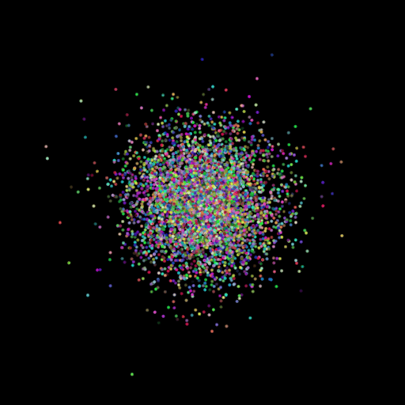
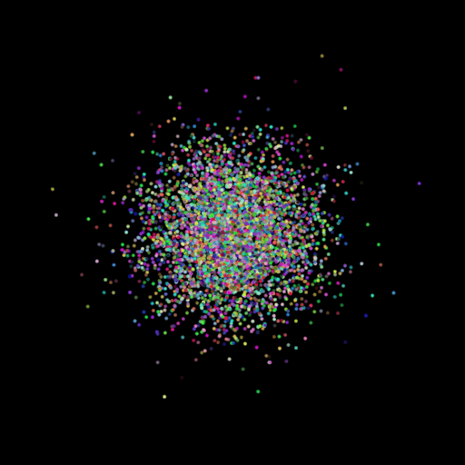

# GAT-PCN
Enhancing Pointcloud Prediction using Geometry-Aware Transformers
<br> 

# DATASET 

## R2N2 

### Download Commands
```
wget http://cvgl.stanford.edu/data2/ShapeNetRendering.tgz
wget http://cvgl.stanford.edu/data2/ShapeNetVox32.tgz
tar -xvzf ShapeNetVox32.tgz
tar -xvzf ShapeNetRendering.tgz
```

### Description

Each folder inside ShapeNetRendering folder and ShapeNetVox32 folder is a category/class which is named as the 'synsetIds'

    "04256520": "sofa",
    "02933112": "cabinet",
    "02828884": "bench",
    "03001627": "chair",
    "03211117": "display",
    "04090263": "rifle",
    "03691459": "loudspeaker",
    "03636649": "lamp",
    "04401088": "telephone",
    "02691156": "airplane",
    "04379243": "table",
    "02958343": "car",
    "04530566": "watercraft"

Inside every category folder, there are different models which have images and other metadata files etc. 
```
The folder structure for ShapeNetRendering:
    - <synsetId>
        - <modelId>
            - 23 .png images (24 views)
            - rendering_metadata.txt
            - renderings.txt

The folder structure for ShapeNetVox32:         
    - <synsetId>
        - <modelId>
            - model.binvox

```

## ShapeNetCorev1

### Download Commands
```
wget shapenet.cs.stanford.edu/shapenet/obj-zip/<category>.zip
Example: wget shapenet.cs.stanford.edu/shapenet/obj-zip/02958343.zip to download the chair category
unzip<category>.zip
```

### Description 

There are similar categories like the the R2N2 dataset. Each category has following strcuture. 
```
    - <synsetId>
        - <modelId>
            - model.obj : (3D Rotatable version of the image)
            - model.mtl : Materials file for OBJ; Includes the name of texture files and material properties.
            - images
                - jpg, png: Textures for the 3D model
```


# Dataset organization for this codebase

**Level 2**
```
├── r2n2_shapenet_dataset
│   ├── r2n2
│   │   ├── ShapeNetRendering
│   │   └── ShapeNetVox32
│   ├── shapenet
│   │   ├── 02958343
│   │   └── 03001627
│   └── splits.json
```
**Level 3 (Truncated - More classes/categories can be present)**
```
── r2n2_shapenet_dataset
├── r2n2
│   ├── ShapeNetRendering
│   │   ├── 02691156
│   │   ├── 02828884
│   │   ├── 02933112
│   │   └── rendering_only.tgz
│   └── ShapeNetVox32
│       ├── 02691156
│       ├── 02828884
│       ├── 02933112
│       └── binvox.tgz
├── shapenet
│       ├── 02691156
│       ├── 02828884
│       ├── 02933112
└── splits.json
```

# SPLITING THE DATASET

If you want to use different categories and need to create the splits again then:

1. Create an **empty** 'splits.json' file at the required location mentioned above
2. Set the 'test_percentage' (line 11) variable and 'categories' (line 36) list in train_test_split.py
3. Run: 'python3 train_test_split.py'
 
Verify that the splits have been written to splits.json file.

# DATASET_LOCTAION.PY

Set the appropiate path references in dataset_location.py

# MODEL.PY

Define the model here 

# TRAIN.PY and R2N2_CUSTOM.PY

The R2N2 class has been modified to add occlusion/patches to the images. Specifically, you can check r2n2_custom.py from line 361 to 371 for details.
The patch will be added at a random location on the image but this can be modified to add at fixed location (line 364 & 365)

Only the following arguments required by the R2N2 class inside r2n2_custom.py are important to us while training:

```
split: "train",
shapenet_dir,
r2n2_dir,
splits_file,
return_voxels: bool = False,
add_occlusion: bool = True,  # If made false, no occulusion will be added 
occlusion_patch_size: int = 50, # sqaure patch of this dimension will be added on image
occlusion_type: str = "black" or "white" or "random"
```

The following line in **train.py** (around line 50) calls the R2N2 class and we need to pass in the values for the above arguments. Please note that this is different from the train_model.py file in assignment-2 and we do not have 'return_feats' argument in the custom R2N2 class anymore, so no need to pass that argument. One example with arguments is as follows: 


```python
Example 1: 
r2n2_dataset = R2N2("train", dataset_location.SHAPENET_PATH, dataset_location.R2N2_PATH, dataset_location.SPLITS_PATH, return_voxels=True, add_occlusion=args.add_occlusion, occlusion_patch_size=40, occlusion_type="random")

Example 2:

r2n2_dataset = R2N2("train", dataset_location.SHAPENET_PATH, dataset_location.R2N2_PATH, dataset_location.SPLITS_PATH, return_voxels=True, add_occlusion=args.add_occlusion, occlusion_patch_size=50, occlusion_type="black")

```

```python

To run with occlusion: python3 train_model.py --type 'point' --add_occlusion
To run without occlusion: python3 train_model.py --type 'point' 

```

# EVAL_MODEL.PY and R2N2_CUSTOM.PY

Make sure to use the same occulusion size and type in eval.py.

```python
Example 1: 
r2n2_dataset = R2N2("test", dataset_location.SHAPENET_PATH, dataset_location.R2N2_PATH, dataset_location.SPLITS_PATH, return_voxels=True, add_occlusion=args.add_occlusion, occlusion_patch_size=40, occlusion_type="random")

Example 2:

r2n2_dataset = R2N2("test", dataset_location.SHAPENET_PATH, dataset_location.R2N2_PATH, dataset_location.SPLITS_PATH, return_voxels=True, add_occlusion=args.add_occlusion, occlusion_patch_size=50, occlusion_type="black")

```

```python

To run: eval_model.py --type 'point' --load_checkpoint --add_occlusion

```

# Notes

1. Modify paths for saving results/checkpoints  and loading checkpoints etc. based on experiment number etc. 
2. You can uncomment line 104 and line 105 in train_model.py to save training images in case you want to see patches
```python
        # for i in range(0,args.batch_size):
        #     plt.imsave(f'./training_images/{step}_{i}.png', images_gt[i].squeeze().detach().cpu().numpy())
```
3. The dataset has been shuffled in train_model.py and eval_model.py so that images from each category are present instead of being sequential 
   
```python
    r2n2_dataset = torch.utils.data.Subset(r2n2_dataset, torch.randperm(len(r2n2_dataset))) 
```

<br> 
<br> 
 <br>
<br> 

After training an extremely simple network:

| Image | Ground Truth Mesh |Predicted Points |
|----|----|----|
||||
||||
||||
||||
||||
||||